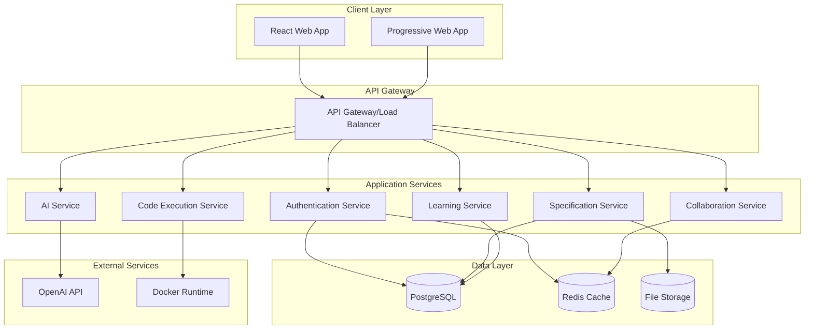

# Design Document

## Overview

CodeMentor-AI is designed as a modern, scalable web application using a microservices architecture with React frontend, Node.js backend services, and containerized deployment. The platform implements a specification-driven development learning environment with real-time collaboration, AI-powered assistance, and secure code execution capabilities.

The system follows a monorepo structure with clear separation of concerns between client, server, and specialized services. The architecture supports horizontal scaling, real-time features, and secure multi-tenant operation.

## Architecture

### High-Level Architecture



### Technology Stack

**Frontend:**

- React 18 with TypeScript
- Vite for build tooling
- Tailwind CSS for styling
- Headless UI for components
- Zustand for state management
- React Hook Form for form handling
- Socket.IO client for real-time features

**Backend:**

- Node.js with TypeScript
- Express.js framework
- Socket.IO for WebSocket connections
- JWT for authentication
- Prisma ORM for database access
- Docker for containerization

**Database & Storage:**

- PostgreSQL for primary data
- Redis for caching and sessions
- AWS S3 for file storage
- Full-text search capabilities

**Infrastructure:**

- Docker Compose for development
- Kubernetes for production deployment
- NGINX for reverse proxy
- GitHub Actions for CI/CD

## Components and Interfaces

### Frontend Components

#### Core Layout Components

```typescript
interface SpecificationLayoutProps {
  currentPhase: SpecificationPhase;
  onPhaseChange?: (phase: SpecificationPhase) => void;
  project?: SpecificationProject;
  showSidebar?: boolean;
  sidebarCollapsed?: boolean;
}

interface NavigationProps {
  phases: SpecificationPhase[];
  currentPhase: SpecificationPhase;
  onPhaseSelect: (phase: SpecificationPhase) => void;
  projectProgress: ProjectProgress;
}
```

#### Specification Editor Components

```typescript
interface SpecificationEditorProps {
  document: SpecificationDocument;
  mode: 'edit' | 'review' | 'readonly';
  onSave: (content: string) => Promise<void>;
  onAIReview?: () => Promise<AIReviewResult>;
  collaborators?: User[];
}

interface AIReviewPanelProps {
  review: AIReviewResult;
  onApplySuggestion: (suggestion: AISuggestion) => void;
  onDismiss: (suggestionId: string) => void;
}
```

#### Collaboration Components

```typescript
interface CollaborationIndicatorProps {
  activeUsers: CollaborationUser[];
  currentUser: User;
  showCursors: boolean;
}

interface CommentThreadProps {
  thread: CommentThread;
  onReply: (content: string) => void;
  onResolve: () => void;
  canModerate: boolean;
}
```

### Backend Service Interfaces

#### Specification Service

```typescript
interface SpecificationService {
  createProject(data: CreateProjectRequest): Promise<SpecificationProject>;
  updateDocument(projectId: string, phase: SpecificationPhase, content: string): Promise<void>;
  getProject(projectId: string): Promise<SpecificationProject>;
  validatePhaseCompletion(projectId: string, phase: SpecificationPhase): Promise<ValidationResult>;
  generateTemplate(type: TemplateType, domain: ProjectDomain): Promise<Template>;
}

interface AIService {
  reviewSpecification(document: SpecificationDocument): Promise<AIReviewResult>;
  generateSuggestions(context: ReviewContext): Promise<AISuggestion[]>;
  validateRequirements(requirements: string): Promise<ValidationResult>;
  assessCodeCompliance(code: string, specifications: string): Promise<ComplianceResult>;
}
```

#### Collaboration Service

```typescript
interface CollaborationService {
  joinDocument(documentId: string, userId: string): Promise<void>;
  broadcastChange(documentId: string, change: DocumentChange): Promise<void>;
  resolveConflict(conflict: EditConflict): Promise<ConflictResolution>;
  addComment(documentId: string, comment: Comment): Promise<CommentThread>;
  getActiveCollaborators(documentId: string): Promise<CollaborationUser[]>;
}
```

#### Code Execution Service

```typescript
interface CodeExecutionService {
  executeCode(request: ExecutionRequest): Promise<ExecutionResult>;
  validateAgainstSpec(code: string, specId: string): Promise<ValidationResult>;
  createSandbox(language: string, dependencies: string[]): Promise<Sandbox>;
  cleanupSandbox(sandboxId: string): Promise<void>;
}
```

## Data Models

### Core Domain Models

```typescript
interface SpecificationProject {
  id: string;
  name: string;
  description: string;
  owner: User;
  team: TeamMember[];
  currentPhase: SpecificationPhase;
  phases: {
    requirements: SpecificationDocument;
    design: SpecificationDocument;
    tasks: SpecificationDocument;
    implementation: ImplementationStatus;
  };
  createdAt: Date;
  updatedAt: Date;
  settings: ProjectSettings;
}

interface SpecificationDocument {
  id: string;
  projectId: string;
  phase: SpecificationPhase;
  content: string;
  version: number;
  status: DocumentStatus;
  lastReview?: AIReviewResult;
  comments: CommentThread[];
  collaborators: CollaborationUser[];
  createdAt: Date;
  updatedAt: Date;
}

interface User {
  id: string;
  email: string;
  name: string;
  avatar?: string;
  role: UserRole;
  skills: SkillLevel[];
  preferences: UserPreferences;
  createdAt: Date;
}

interface AIReviewResult {
  id: string;
  documentId: string;
  overallScore: number;
  suggestions: AISuggestion[];
  completenessCheck: CompletenessResult;
  qualityMetrics: QualityMetrics;
  generatedAt: Date;
}
```

### Learning and Progress Models

```typescript
interface LearningModule {
  id: string;
  title: string;
  description: string;
  phase: SpecificationPhase;
  difficulty: DifficultyLevel;
  prerequisites: string[];
  content: LessonContent[];
  exercises: Exercise[];
  estimatedDuration: number;
}

interface UserProgress {
  userId: string;
  moduleId: string;
  status: ProgressStatus;
  completedLessons: string[];
  exerciseResults: ExerciseResult[];
  skillAssessments: SkillAssessment[];
  lastAccessed: Date;
}

interface TeamAnalytics {
  teamId: string;
  period: AnalyticsPeriod;
  metrics: {
    projectsCompleted: number;
    averagePhaseTime: Record<SpecificationPhase, number>;
    qualityScores: QualityTrend[];
    collaborationMetrics: CollaborationMetrics;
    skillDevelopment: SkillDevelopmentMetrics;
  };
}
```

## Error Handling

### Client-Side Error Handling

```typescript
// Global error boundary for React components
class SpecificationErrorBoundary extends React.Component {
  // Handle specification-specific errors
  // Provide fallback UI for different error types
  // Log errors for monitoring
}

// API error handling with typed responses
interface ApiError {
  code: string;
  message: string;
  details?: Record<string, any>;
  timestamp: Date;
}

// Service-specific error types
enum SpecificationErrorCode {
  PHASE_VALIDATION_FAILED = 'PHASE_VALIDATION_FAILED',
  DOCUMENT_CONFLICT = 'DOCUMENT_CONFLICT',
  AI_SERVICE_UNAVAILABLE = 'AI_SERVICE_UNAVAILABLE',
  CODE_EXECUTION_TIMEOUT = 'CODE_EXECUTION_TIMEOUT',
  COLLABORATION_SYNC_FAILED = 'COLLABORATION_SYNC_FAILED',
}
```

### Backend Error Handling

```typescript
// Centralized error handling middleware
interface ErrorHandler {
  handleSpecificationError(error: SpecificationError): ErrorResponse;
  handleValidationError(error: ValidationError): ErrorResponse;
  handleAuthenticationError(error: AuthError): ErrorResponse;
  handleRateLimitError(error: RateLimitError): ErrorResponse;
}

// Service-level error recovery
interface ErrorRecoveryStrategy {
  retryWithBackoff(operation: () => Promise<any>, maxRetries: number): Promise<any>;
  fallbackToCache(key: string): Promise<any>;
  gracefulDegradation(feature: string): Promise<any>;
}
```

## Testing Strategy

### Frontend Testing

**Unit Testing:**

- Component testing with React Testing Library
- Hook testing with @testing-library/react-hooks
- Utility function testing with Jest
- State management testing with Zustand test utilities

**Integration Testing:**

- API integration testing with MSW (Mock Service Worker)
- Real-time collaboration testing with Socket.IO mock
- Form submission and validation testing
- Navigation and routing testing

**End-to-End Testing:**

- Specification workflow testing with Playwright
- Multi-user collaboration scenarios
- AI review integration testing
- Code execution and validation flows

### Backend Testing

**Unit Testing:**

- Service layer testing with Jest
- Database operation testing with test database
- Authentication and authorization testing
- AI service integration testing with mocked responses

**Integration Testing:**

- API endpoint testing with Supertest
- Database integration testing with test containers
- WebSocket connection testing
- External service integration testing

**Performance Testing:**

- Load testing for concurrent collaboration
- Code execution service performance testing
- Database query optimization testing
- Real-time feature scalability testing

### Security Testing

- Authentication flow security testing
- Authorization boundary testing
- Input validation and sanitization testing
- Code execution sandbox security testing
- Data encryption and privacy testing

### Accessibility Testing

- Screen reader compatibility testing
- Keyboard navigation testing
- Color contrast and visual accessibility testing
- ARIA attribute validation
- Focus management testing

This design provides a comprehensive foundation for building the CodeMentor-AI platform with proper separation of concerns, scalable architecture, and robust error handling and testing strategies.
